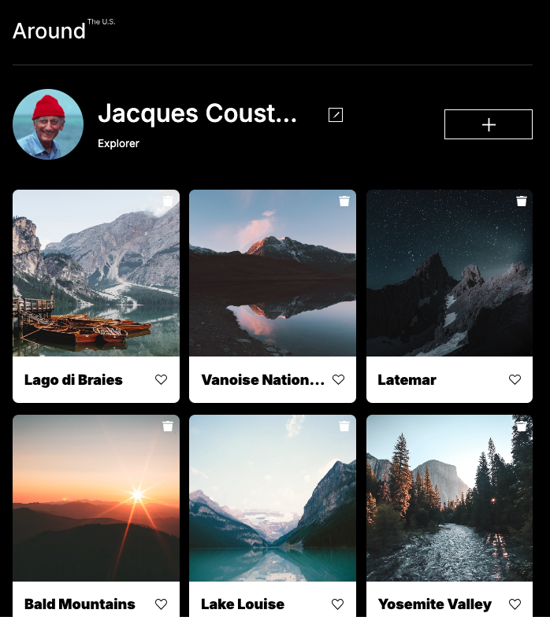
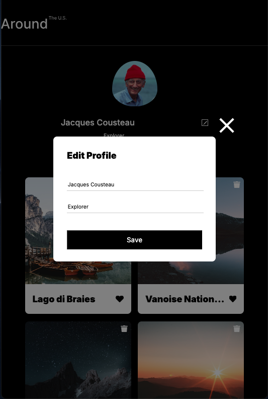
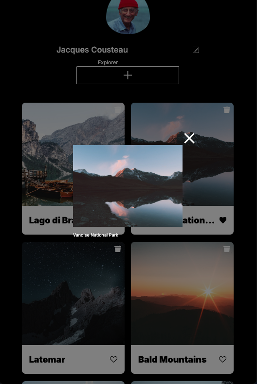
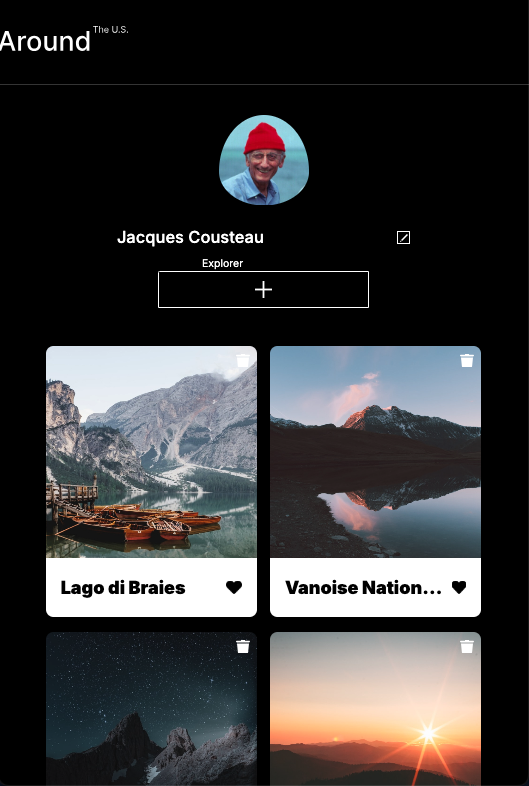
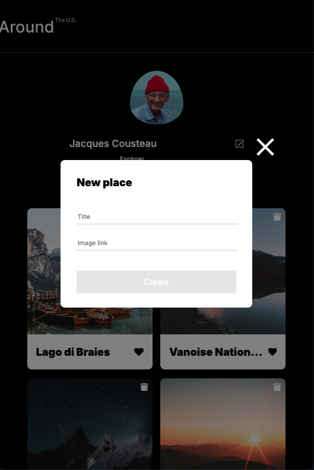
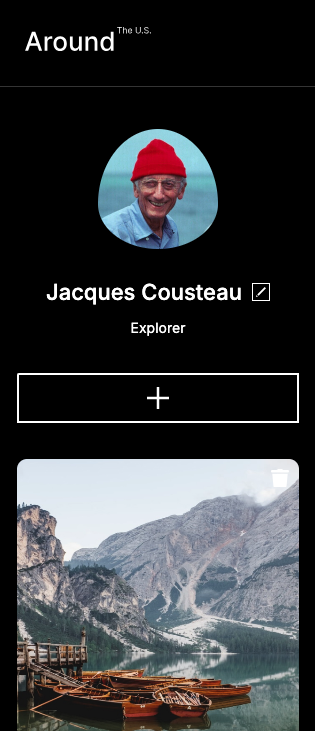
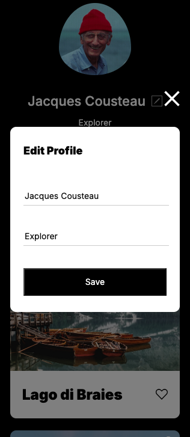
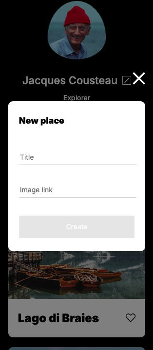

# 🌎 Around The U.S. — Responsive Web Project


This project demonstrates a responsive, adaptive layout using modern HTML and CSS. Users can explore a profile-based photo gallery, like images, and enjoy a seamless experience across devices.

**[View the live project on GitHub Pages](https://jhm323.github.io/se_project_aroundtheus/)**

## 🎯 Project Objective

The goal of Around The U.S. is to create a fully responsive and visually polished web page that showcases user-uploaded photographs.

**Key objectives:**

- Implement responsive layouts with Flexbox and CSS Grid
- Maintain semantic, accessible HTML structure
- Use BEM methodology for clean, maintainable CSS
- Ensure smooth scaling and readability on all devices

## ⚡ Features

- Responsive card grid with interactive "like" buttons
- Profile section with editable data
- Adaptive layout from mobile (320px) to desktop (1280px+)
- Smooth text overflow handling with ellipses
- Hover states and subtle UI enhancements
- Fully semantic HTML structure

## 🖼 Screenshots / Visual Walkthrough

### Desktop View



### Tablet View






### Mobile View





Demonstrates responsive behavior, semantic layout, and clean card grid presentation.

## 🛠 Technologies Used

- **HTML5** — Semantic markup
- **CSS3** — Flexbox, Grid, media queries, animations
- **BEM methodology** — Modular CSS
- **Normalize.css** — Cross-browser consistency
- **Git & GitHub** — Version control
- **Figma** — Design reference

## 📱 Responsive Design

Optimized for three main screen widths:

| Device  | Width Range      | Layout Description       |
| ------- | ---------------- | ------------------------ |
| Mobile  | 320px – ~600px   | Single-column layout     |
| Tablet  | ~600px – 1024px  | Two-column card layout   |
| Desktop | 1024px – 1280px+ | Three-column card layout |

**Responsive techniques used:**

- `flex-wrap` and `justify-content` for dynamic alignment
- `auto-fit` with `minmax()` in Grid layouts
- Relative units (`%`, `fr`) for flexible spacing
- `object-fit` to maintain image proportions

## ⚙️ Project Setup

Clone the repository:

```bash
git clone https://github.com/yourusername/se_project_aroundtheus.git
cd se_project_aroundtheus
```

Open `index.html` in a browser or use DevTools to test responsiveness.

## 📂 File Structure

```
images/ → All image assets
pages/ → HTML files (main: index.html)
blocks/ → Modular BEM-style CSS files
vendor/
├── fonts/ → Inter font files
├── fonts.css → Font-face declarations
└── normalize.css → Reset styles
index.css → Main stylesheet (imports all block styles)
README.md
```

## 🔤 Fonts

**Primary:** Inter

**Fallbacks:** Arial, sans-serif

**Font files:** https://rsms.me/inter/

Loaded via local files and declared in `vendor/fonts.css`.

## 🎥 Video Walkthrough

Watch the project tour: Adaptive Web Design Video

Covers:

- Layout overview
- Media query implementation
- BEM and semantic HTML usage
- Responsive card behavior

## 💡 What I Learned

- Creating responsive grids with auto-fit and minmax()
- Using Flexbox for layout control
- Managing text overflow with ellipsis
- Structuring CSS with BEM methodology
- Semantic HTML and accessibility best practices
- Extracting design specs from Figma

## 🏁 Conclusion

This project demonstrates adaptive, responsive web design across mobile, tablet, and desktop. Users interact with a clean, semantic layout that scales smoothly. Using BEM and mobile-first design ensures maintainability, scalability, and visual consistency — production-ready frontend skills in action.

## 🚀 Future Improvements & Business Impact

- Add JavaScript interactivity (modals, form validation, dynamic likes)
- Persist user data with localStorage or backend integration
- Improve accessibility with ARIA roles and contrast checks
- Optimize images and assets for performance and SEO
- Expand into a multi-page gallery or social platform

These enhancements could increase engagement, improve discoverability, and support user retention for a photo-sharing web app.

## 🌐 Browser & Performance

- Tested across modern browsers
- Loads quickly and adapts seamlessly across devices
- No horizontal scrolling at any width

## 🏆 Submission Checklist

- Mobile, tablet, and desktop layouts implemented
- Follows BEM methodology
- Fonts and normalize.css included
- Responsive card grid
- No horizontal scrolling at any width
- Deployed on GitHub Pages
- Walkthrough video recorded and linked

## 👤 Credits

- Designed by TripleTen
- Font by Rasmus Andersson
- Figma design provided in curriculum

## Feel free to fork, clone, and explore. Happy coding!
